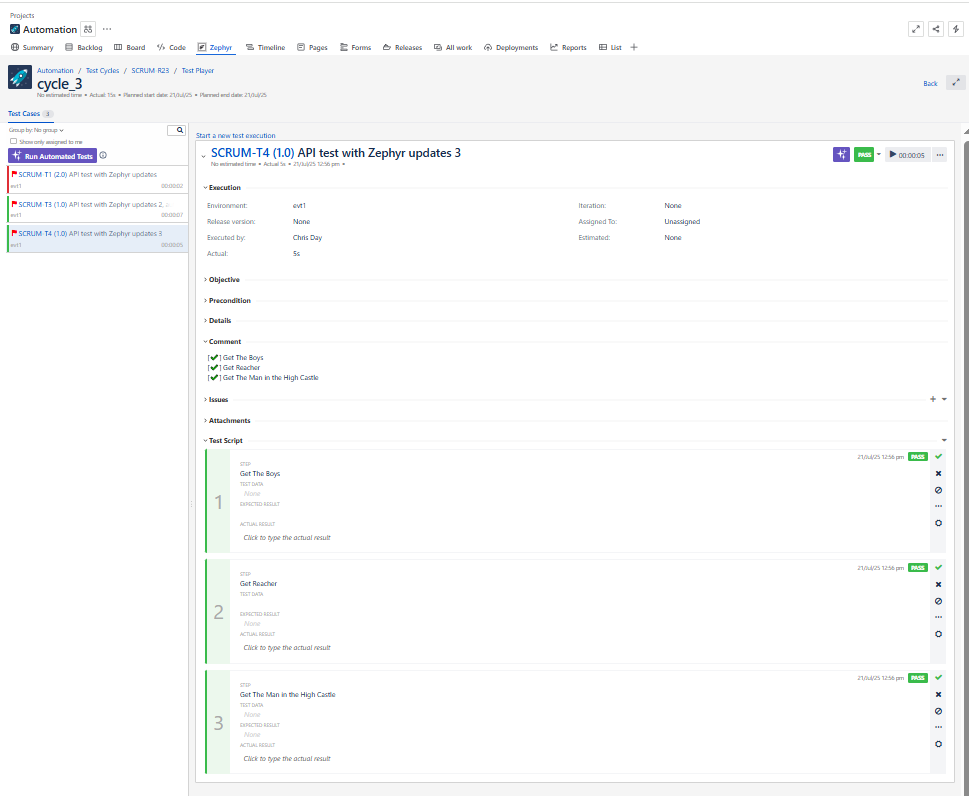

# mocha-zephyr-automation
Update Zephyr Essential test cycles from automated Mocha test scenarios


## Install
Add mocha-zephyr-automation to your project by adding it to to your package.json:
```
  "dependencies": {
    "mocha-zephyr-automation": "github:CDTester/mocha-zephyr-automation"
  },
```
Then install it with:
```
npm i
```

## Usage
Usage examples can be found on github [mocha-zephyr-automation](https://github.com/CDTester/mocha-zephyr-automation).

In these expamples, the Zephyr config values are stored in a config default.json file. These configs contain details like:
```
{
    "zephyrOptions": {
        "token": "npm_config_zephyr_api_token",
        "environment": "npm_config_testenv",
        "project": "npm_config_zephyr_project_name",
        "cycleVersion": "npm_config_zephyr_project_name",
        "cycleFolder": "npm_config_zephyr_cycle_folder",
        "cycleFolderHieracrhy": "npm_config_zephyr_cycle_folder_parent",
        "cycleName": "npm_config_zephyr_cycle_name",
        "updateZephyr": "npm_config_zephyr_update"
    }
}
```

The:
- `token` is your Zephyr API Access Token.
- `environment` is a string variable for the environment name that is set up in Zephyr.
- `project` is a string variable for the Jira key of your project.
- `cycleVersion` is a string variable for the name of the cycle that the test executions will be updated in.
- `cycleFolder` is a string variable for the name of the folder that the test cycle belongs to.
- `cycleFolderHieracrhy` is an array detailing the folder heirachy to where the `cycleFolder` exists. e.g  ['1.0.5', 'July 2025']. If the `cycleFolder` is to be created as a root folder then use an empty array.
- `cycleName` is a string variable for the name of the cycle that exists or to be created in the `cycleFolder`.
- `updateZephyr` is a string variable that determines if Zephyr is to be updated by the test run. The values are either 'yes' or 'no'.


In this example, the values are saved in the .npmrc file as e.g. 'zephyr_project_name' which when the tests are run are saved in process.env variables as e.g. 'npm_config_zephyr_project_name'. The values can be replaced with variable names that can be created in your CI/CD application.

In the test script, the class is initiated using:
```
import zephyrAutomation from 'mocha-zephyr-automation';
const zephyr:zephyrAutomation = new zephyrAutomation();
```

After the class has been initiated, the function `setup` needs to be called in a before hook (to avoid test step mismatch from automated test to Zephyr test) to check if folders/cycles/test execution exists for that test by calling:
```
before(`initiate zephyr`, async function () {
  let zephyrData = await zephyr.setup(zephyrTest);
});
```
This function requires the test case key name e.g. 'PROJ-T1'

Finally, to update zephyr after the test run, call the following in an after hook:
```
after(`update zephyr`, async function () {
  if (this.test !== undefined) {
    await zephyr.updateTestExecution(this.test);
  }
});
```

### Console log when Zephyr is not set to be updated


### Console log when Zephyr is set to be updated


### Zephyr Test Cases


### Zephyr Test Cycles


### Zephyr Test Execution updated


### Zephyr Test Execution where a test step failed


### Zephyr Test Execution steps not updated due to a mismatch between automated test steps and Zephyr test steps

